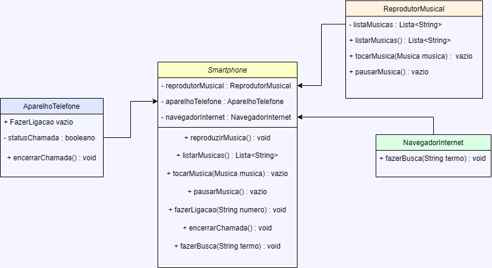

# Desafio: Dio  java smartphone

## Descrição do Desafio

Chegou a hora de colocarmos em prática toda a concepção de análise de negócios, requisitos, conceitos da programação orientada a objetos e modelagem UML, elabore em uma ferramenta de UML de sua preferência. A diagramação das classes e interfaces com a proposta de representar os papéis do iPhone de: Reprodutor Musical, Aparelho Telefônico e Navegador na Internet. Em seguida, crie as classes e interfaces no formato de arquivos .java.

## Pré-requisitos

- Lógica de programação e POO;
- Conhecimentos básicos(Java);
- Computador com SO de sua preferência (Windows, Linux, Mac OS);
- IDE (Visual Studio Code, Eclipse, etc).

